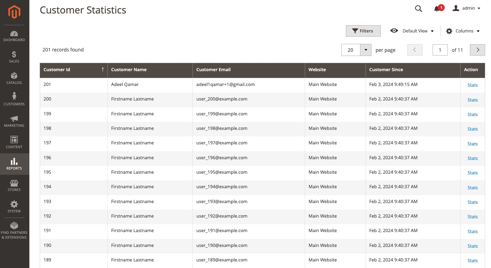
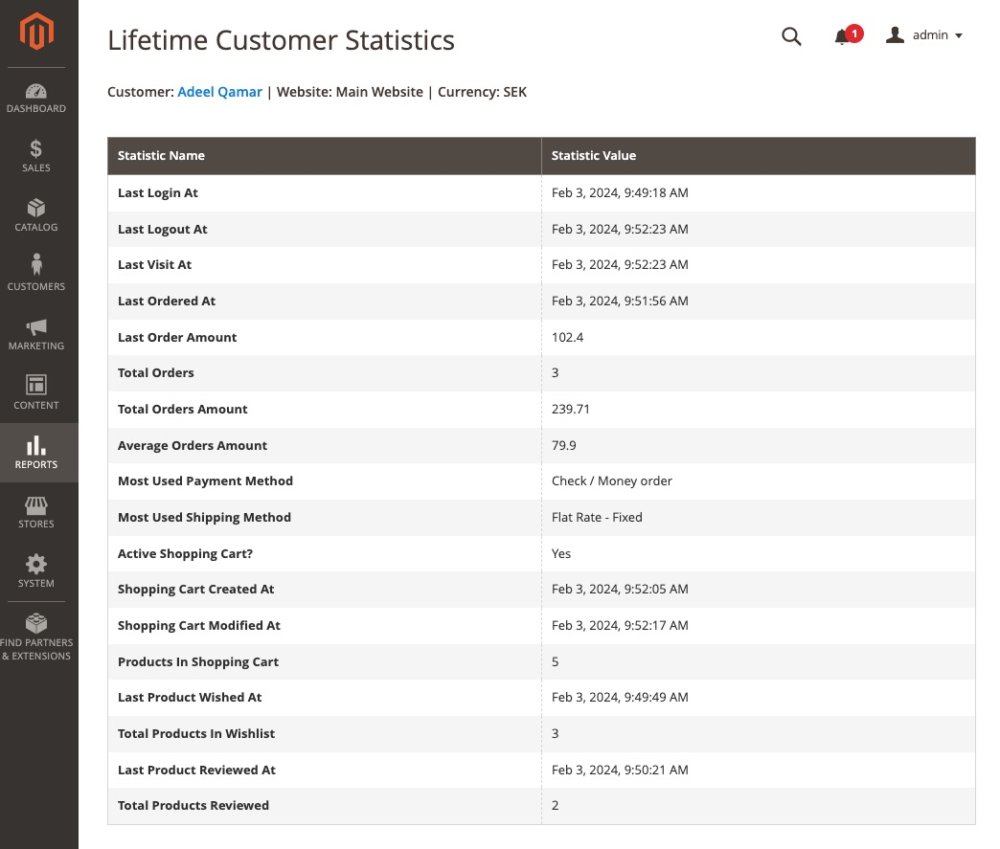

Magento 2 - Customer Statistics
 ======
 
[](../CoreConfigDataViewer/LICENSE)

A module which adds grid in Magento admin backOffice for viewing customer lifetime statistics. User can view the statistics for each individual customer from associated website in table format.

## Requirements

- Magento 2.3+
- Adeelq core module

## Installation

It is recommended to use [composer](https://getcomposer.org) to install the module.

```bash
composer require adeelq/magento2-customer-statistics
```
If you do not use composer, ensure that you also load any dependencies that this module has.

## Screenshots
### Menu


### Grid page


### Customer statistics page

